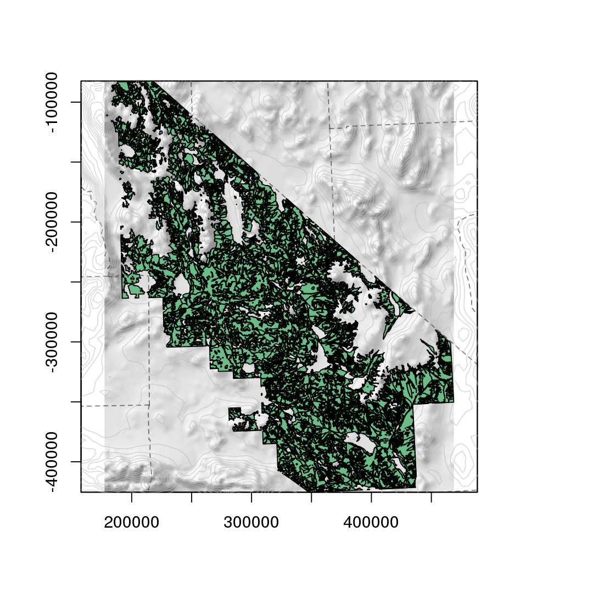

```{r setup, include=FALSE}
knitr::opts_knit$set(self.contained=TRUE)
fig.dim <- 8
knitr::opts_chunk$set(
           fig.width=1.4*fig.dim,
           fig.height=fig.dim,
           fig.align='center',
           dev.args=list(pointsize=24),
           error=FALSE )
library(raster); library(rgeos); library(landsim)
```
```{r setup_habitat_one_sigma, include=FALSE, cache=2}
if (!file.exists("desert_veg_central_small.RData")) {
    layer.dir <- "/home/peter/projects/patchy-landscapes/layers"
    vegmap <- readOGR(file.path(layer.dir,"desert_veg/central","ds166"))
    this.ex <- c(354660.90906967, 381245.239994035, -273140.670781638, -251867.619631655)
    smallveg <- crop(vegmap,this.ex)
    source(file.path(layer.dir,"layer_utils.R",chdir=TRUE))
    counties <- get_counties(smallveg)
    elev <- get_dem(smallveg)
    shade <- get_elev(smallveg)
    smallveg$LABEL_1 <- droplevels(smallveg$LABEL_1)
    save(smallveg,counties,elev,shade,file="desert_veg_central_small.RData")
} else {
    load("desert_veg_central_small.RData")
}

hcols <- c( Blackbrush="#FF9400FF", Creosote="#FFC500FF", 'Creosote-Brittlebush'="#FFF700FF", 'Desert Holly'="#D6FF00FF", 'Joshua Tree'="#00FF52FF", 'Low Elevation Wash System'="#00E6FFFF", 'Mid Elevation Wash System'="#0052FFFF", 'Mojave Yucca'="#1000FFFF" )
hcols <- hcols[match(levels(smallveg$LABEL_1),names(hcols))]
```

# Adaptation to climate change

--------------

*Rapid* climate change:

- occurring over tens of generations
- different environment $\Rightarrow$ strong selective pressure

*This talk:* population genetics considerations.


-----------------

**What I'm not talking about:**

- local adaptation
- plasticity
- genetic architecture
- population size dynamics
- interspecific interactions

**What I am talking about:**

- most organisms don't live on billiard tables


Questions
---------

How does geography affect how adaptive variants

1. arise and

2. spread,

3. and how much variation is left afterwards?


--------------

**Can adaptations spread?**

- with moving environmental gradients
- or from locations of existing variants

Also relevant for:

- Do adaptive variants spread along wildlife corridors?
- What is the spatial resolution of adaptation?


------------------------------

{ height=6in }

------------------------------

**Population genetics wants to know:**

1.  population size

    - availability of standing deleterious variation
    - influx of new mutations

2.  strength of selection

    - probability of establishment of rare variants
    - rate of spread of adaptive variants

3.  rate of genetic drift

    - rate of local loss of variation
    - probability of establishment of rare variants


-----------------

these are affected by

**geography ${}+{}$ dispersal ${}+{}$ temporal dynamics**


# Mojave Desert habitats

------------


{ height=6in }

Cal DFG; Todd Keeler-Wolf, CNPS (http://vegetation.cnps.org/)[http://vegetation.cnps.org/]

---------------

Zoomed-in (NVCS macrogroup):

```{r veg_chunk, echo=FALSE, fig.height=0.8*fig.dim}
layout(t(1:2),width=c(2.6,1))
par(mar=c(2,2,0,0)+.1)
opar <- par(mar=c(par("mar"),0)[c(1,5,3,5)])
plot(smallveg,col=hcols[smallveg$LABEL_1],border='black')
axis(1:2)
plot(0,xaxt='n',yaxt='n',xlab='',ylab='',type='n',bty='n')
legend("topleft",legend=levels(smallveg$LABEL_1), fill=hcols[levels(smallveg$LABEL_1)], cex=0.75, bty='n')
par(opar)
```

---------------

**Environmental niche models:** (Biogeography Lab, UCSB)

```{r niche_plot, echo=FALSE}
if (FALSE) { # do this elsewhere
    x <- raster("cleaned/Yucca_brevifolia_broad_extent_avg_cleaned.tif")
    y <- raster("cleaned/Eschscholzia_minutiflora_ssp_twisselmannii_broad_extent_avg_cleaned.tif")
    elev <- get_elev( raster(c(1.4,1)*extent(x), crs=CRS(proj4string(x))) )
    counties <- get_counties( raster(c(1.4,1)*extent(x), crs=CRS(proj4string(x))) )
    
    png(file="niche-models.png",width=6*180,height=3*180,pointsize=10,res=180)
    layout(t(1:2))
    par(mar=c(0,0,2,0)+0.2)
    plot(elev,col=grey(seq(0.5,1,length.out=101)),legend=FALSE,main="Yucca brevifolia", xaxt='n', yaxt='n')
    plot(x,add=TRUE,legend=FALSE,col='red')
    lines(counties)
    plot(elev,col=grey(seq(0.5,1,length.out=101)),legend=FALSE, main="Eschscholzia minutiflora", sub="ssp twisselmannii", xaxt='n', yaxt='n')
    plot(y,add=TRUE,legend=FALSE,col='red')
    lines(counties)
    dev.off()
}
```


Demographic model
-----------------

- 200m grid
- equilibrium density: 0.4 (low) or 16 (high) / ha 
- R package: [github.com/petrelharp/landsim](github.com/petrelharp/landsim)

```
demography(
    prob.seed = 0.2, fecundity = 100,
    pollen.migration = migration(
        kern = function (x) { exp(-sqrt(x)) },
        sigma = 300, radius = 1200, normalize = NULL ),
    seed.migration = migration(
        kern = "gaussian", sigma = 100,
        radius = 1200, normalize = 1 ),
    prob.germination = vital(
        function (N, ...) {
            out <- r0 / ( 1 + rowSums(N)/carrying.capacity )
            return( cbind( aa=out, aA=(1+s)*out, AA=(1+s)^2*out ) )
        },
        r0 = 0.01,  s = 0.05 ),
    prob.survival = 0.9,
    genotypes = c("aa","aA","AA")
 )
```


# Rate of genetic drift

-------------

**Wright's neighborhood size:**

$$ N_\text{loc} \propto \#\{ \text{ individuals within 1$\sigma$ } \}, $$

where 

-  $\sigma$ is the **dispersal distance**
-  *individuals* are haploid.

Local heterozygosity is
$$ H_0 \propto \frac{N_\text{loc}}{C + N_\text{loc}}, $$
where $C$ depends on mutation rate and geometry.

(Barton, Depaulis, & Etheridge)

<!--
in 1D prob of IBD is
$$ \phi(x) = \exp(-|x| \sqrt{2 \mu}/\sigma) / ( 1 + 2 N_{loc} \sigma \sqrt{2\mu} ) $$
and in 2D
$$ 1-\phi(0) = N_{\loc}/(N_{\loc} + \log(\sigma/(K\sqrt{2\mu}))) $$
For large $x$, we know $K_0(x) \sim \exp(-x)/\sqrt{x}$.
-->


-----------------

$N_\text{loc}$ at different scales depends on population density
and *amount of nearby habitat:*

```{r habitat_one_sigma, echo=FALSE, cache=2, depends="setup_habitat_one_sigma", fig.height=0.8*fig.dim}

refpoint.list <- list( 
       "Creosote" = cbind(x=369276.5, y=-260411.1),
       "Low Elevation Wash System" = cbind(x=365959.7, y=-260357.6)
   )
refcol <- c( Creosote="red", "Low Elevation Wash System"="blue" )
radii <- c(1000,5000)

layout(t(1:2))
par(mar=c(0,0,0,0)+.5)
for (vegtype in names(refpoint.list)) {
    thisveg <- subset( smallveg, LABEL_1==vegtype )
    # refpoints <- spsample( thisveg, n=1, type='random' )
    refpoints <- SpatialPoints( refpoint.list[vegtype], proj4string=CRS(proj4string(smallveg)) )
    refcircles <- make_circles( refpoints[rep(1,length(radii))], radii=radii )
    habcircles <- gIntersection( refcircles, crop(thisveg,3*extent(refcircles)), byid=c(TRUE,FALSE) )

    plot( smallveg, col=adjustcolor(hcols[smallveg$LABEL_1],0.2) ) #, add=TRUE )
    plot( habcircles, col=adjustcolor(refcol[vegtype],0.5), add=TRUE, border=NA )
    lines(refcircles, lty=2 )
    points(refpoints,pch="*", col='red')
}

```

-----------------

NVCS Macrogroup, central Mojave:

```{r vol_versus_radius, echo=FALSE, cache=2, fig.width=1.8*fig.dim}
source("habitat-shapes.R")
mean.areas <-  sapply( central.mojave.area.results, colMeans )
area.units <- 1e4 # ha
layout(t(1:2),width=c(3,1))
par(mar=c(4,4,1,1)+.1)
matplot(central.mojave.radii, area.units*mean.areas/(pi*central.mojave.radii^2), type='l', log='x', ylab="proportion of circle covered", xlab="radius (m)")
opar <- par(mar=c(par("mar"),0)[c(1,5,3,5)])
plot(0,xaxt='n',yaxt='n',xlab='',ylab='',type='n',bty='n')
legend("topleft",legend=colnames(mean.areas),lty=1:5,col=1:6, cex=0.6, bty='n')
```

----------

Creosote:

{ height=6in }

----------

Blackbrush:

{ height=6in }

----------

Wash:

{ height=6in }


-----------------

**Genetic drift:** 

$$\var[p_{t+1}|p_t]/p_t(1-p_t) \text{  against  } N_\text{loc}$$

{ height=4.5in }


# Probability of establishment

-------------------

The *probability of establishment* 
of a single allele
in a large population is
$$ p_\text{estab} \approx 2 s / \nu , $$

-  where $\nu$ is the strength of drift
- $s$ is growth rate when rare.

If $s < 1/N_\text{loc}$, *local inbreeding* 
may reduce $p_\text{estab}$.


----------------------------

```{r plot_pestab, echo=FALSE}
source("establishment-probs.R") # provides establishment.probs
source("establishment-probs_low-density.R") # provides low.density.establishment.probs

all.pestabs <- data.frame( habitat=rep(names(establishment.probs),sapply(establishment.probs,nrow)),
        do.call( rbind, establishment.probs ) )
pestabs <- aggregate( all.pestabs$p_estab, all.pestabs[c("habitat","s")], mean )
names(pestabs)[match("x",names(pestabs))] <- "p_estab"

all.pestabs.ld <- data.frame( habitat=rep(names(low.density.establishment.probs),sapply(low.density.establishment.probs,nrow)),
        do.call( rbind, low.density.establishment.probs ) )
all.pestabs.ld$habitat <- factor( all.pestabs.ld$habitat, levels=levels(pestabs$habitat) )
pestabs.ld <- aggregate( all.pestabs.ld$p_estab, all.pestabs.ld[c("habitat","s")], mean )
names(pestabs.ld)[match("x",names(pestabs.ld))] <- "p_estab"

# remove "western"/"central", "/wetland", "woods/"
levels(pestabs$habitat) <- levels(pestabs.ld$habitat) <- gsub("woods.","",gsub(".wetland","",gsub("western |central ","",levels(pestabs$habitat))))
# remove non-plants
pestabs <- subset( pestabs, ! habitat %in% c("empidonax","xerospermophilus") )
pestabs$habitat <- droplevels(pestabs$habitat)
pestabs.ld <- subset( pestabs.ld, ! habitat %in% c("empidonax","xerospermophilus") )
pestabs.ld$habitat <- factor(pestabs$habitat,levels=levels(pestabs$habitat))

par(mar=c(4,4,1,1)+.1)
with(pestabs, plot(s, p_estab, col=habitat, xlab="s", ylab="prob of establishment", pch=20) )
 with(pestabs.ld, points(s, p_estab, col=habitat ) )
legend("topleft",pch=20,legend=levels(pestabs$habitat),cex=0.75,col=1:nlevels(pestabs$habitat))
legend("bottomright",pch=c(1,20),legend=c("low density","high density"),cex=0.75)
for (hab in levels(pestabs$habitat)) {
    # abline(0,coef(lm(p_estab ~ s + 0, data=data.frame(establishment.probs[[k]]))), col=k)
    abline(coef(lm(p_estab ~ s, data=subset(pestabs,habitat==hab))),
           col=match(hab,levels(pestabs$habitat)) )
    abline(coef(lm(p_estab ~ s, data=subset(pestabs.ld,habitat==hab))),
           col=match(hab,levels(pestabs.ld$habitat)), lty=3 )
}
#  cbind( high=with( pestabs, tapply( p_estab/s, habitat, mean ) ),
#         low=with( pestabs.ld, tapply( p_estab/s, habitat, mean ) ) )
```


# Speed of spread

---------------

Alleles that are advantageous when rare
spread, like *wildfire*. 
(a "pulled" wave)

**Continuous habitats**

- speed: $\sigma \sqrt{2s}$ (Fisher/KPP)
    * $s$ is *growth rate when rare*
    * takes 1-10 generations to move a dispersal distance

- leptokurtic dispersal: patchy, accelerating (Mollison 1972)

- slowed by drift

---------

**Huygens principle:** the wave has to go around barriers (Möbius, Murray, & Nelson 2015)

- *tortuosity*: ratio of length of curve to distance between its ends


```{r setup_wildfire_spread, echo=FALSE, cache=2}
if (!file.exists("desert_veg_central_small_raster.RData")) {
    z <- lapply( levels(smallveg$LABEL_1), function (vt) { gUnaryUnion( subset(smallveg,LABEL_1==vt) ) } )
    rz <- lapply(z, function (x) { rasterize(x, raster(extent(smallveg),res=100), getCover=TRUE ) } )
    rasterveg <- do.call( stack, rz )
    # rasterveg <- rasterize(smallveg,raster(extent(smallveg),res=50),"LABEL_1",getCover=TRUE)
    values(rasterveg) <- values(rasterveg)/100
    names(rasterveg) <- levels(smallveg$LABEL_1)
    save(rasterveg, file="desert_veg_central_small_raster.RData")
} else {
    load("desert_veg_central_small_raster.RData")
}
```
```{r setup_demog, echo=FALSE, cache=2}
demog <- demography(
        prob.seed = 0.2, fecundity = 100,
        prob.germination = vital( 
                 function (N, ...) {
                     out <- r0 / ( 1 + rowSums(N)/carrying.capacity )
                     return( cbind( aa=out, aA=s*out, AA=s^2*out ) )
                 },
                 r0 = 0.01,  s = 1.5 ),
        prob.survival = 0.9,
        pollen.migration = migration(
                 kern = function (x) { exp(-sqrt(x)) },
                 sigma = 300, radius = 1200, normalize = NULL ),
        seed.migration = migration(
                 kern = "gaussian", sigma = 100,
                 radius = 1200, normalize = 1 ),
        genotypes = c("aa","aA","AA")
    )
```
```{r run_sim, echo=FALSE, cache=2, depends=c("setup_wildfire_spread","setup_habitat_one_sigma","setup_demog")}
if (!file.exists("wildfire-sims.RData")) {
    wildfire.vegtypes <- c("Low Elevation Wash System","Creosote")
    mutloc <- list( center=SpatialPoints( cbind(x=358709.2, y=-258082.9), proj4string=CRS(proj4string(smallveg)) ) )
    wildfire.sims <- lapply( wildfire.vegtypes,  function (vegtype) {
            habitat <- rasterveg[[make.names(vegtype)]]
            carrying.capacity <- 120 * prod(res(habitat))/270^2  # estimated from google maps near desert queen mine
            habitable <- (!is.na(values(habitat)) & values(habitat)>0)
            pop <- population( 
                              habitat = habitat,
                              # accessible = !is.na(values(habitat)),
                              accessible = habitable,
                              habitable = habitable,
                              genotypes = c("aa","aA","AA"),
                              carrying.capacity = carrying.capacity,
                              N = cbind( aa=rpois(sum(habitable),carrying.capacity),
                                         aA=0, AA=0 )
                         )
            demog <- setup_demography( demog, pop )
            # summary functions
            # distance
            dists <- pointDistance( mutloc$center, xyFromCell(pop$habitat,which(pop$habitable)), lonlat=FALSE )
            # distance to the mutation center for each habitable cell
            volume_fun <- function (N) { colSums(N>0) }
            radius_fun <- function (N) { apply( N, 2, function (x) { suppressWarnings( max( dists[ x>0 ] ) ) } ) }
            summary.funs <- list( totals=function(N){colSums(N)}, volume=volume_fun, radius=radius_fun)
            # burn-in
            sim <- simulate_pop( pop, demog, times=c(0,100) )
            pop$N[] <- sim$N[,,2]
            mutloc$cell.number <- match( cellFromXY( habitat, mutloc$center ), which(habitable) )
            for (ntries in 1:100) {
                pop <- set_N( pop, i=which(pop$habitable), j="aA", 
                         value=ifelse(1:nrow(pop$N)==mutloc$cell.number,3,0) )
                sim <- simulate_pop( pop, demog, times=seq(0,100,length.out=11),
                                 summaries= summary.funs )
                total.aA <- sim$summaries[[1]][nrow(sim$summaries[[1]]),"aA"]
                if ( total.aA>0 ) { break }
            }
            sim <- extend_simulation( sim, pop, demog, times=seq(sim$t,1000,length.out=101), summaries=summary.funs )
            return(list(pop=pop,sim=sim))
        } )
    names(wildfire.sims) <- wildfire.vegtypes
    save(mutloc,wildfire.sims,wildfire.vegtypes, file="wildfire-sims.RData")
} else {
    load("wildfire-sims.RData")
}
```
```{r animate_wildfire, echo=FALSE, cache=2, depends="run_sim"}
for (vegtype in names(wildfire.sims)) {
    outfile <- paste("spatial-sweep-",gsub(" ","_",vegtype),".mp4",sep='')
    if (!file.exists(outfile)) {
        plot.simulation( wildfire.sims[[vegtype]]$sim, wildfire.sims[[vegtype]]$pop,
                    animate=outfile, duration=20, width=12, height=4, pointsize=18 )
    }
}
```
------------------

{ width=10in height=3.33333in }

------------------

{ width=10in height=3.33333in }


------------------

```{r show_speeds_wash, cache=2, depends="run_sim", echo=FALSE}
vegtype <- "Low Elevation Wash System"
speeds <- list()
speeds[[vegtype]] <- with( list2env(wildfire.sims[[vegtype]]), {
        plot( sim$summary.times, sim$summaries[["radius"]][,c("AA")], type='l', col=hcols[vegtype],
                xlab="generation", main='radius of adaptive wave', ylab='distance (m)', xlim=c(0,500) )
        legend( "bottomright", legend=names(wildfire.sims), lty=1,
               col=c(hcols[names(wildfire.sims)]), cex=0.75 )
        AA.lims <- c(1.2,0.8)*range(sim$summaries[["radius"]][,"AA"],finite=TRUE)
        AA.usethese <- which( ( sim$summaries[["radius"]][,"AA"] > AA.lims[1] ) 
                              & ( sim$summaries[["radius"]][,"AA"] < AA.lims[2] ) )
        AA.speed <- diff( sim$summaries[["radius"]][range(AA.usethese),"AA"] ) / diff( sim$summary.times[range(AA.usethese)] )
        if (sum(!is.na(AA.usethese))>0) {
            points(  sim$summary.times[range(AA.usethese)], sim$summaries[["radius"]][range(AA.usethese),"AA"], pch=20, col=hcols[vegtype] )
            abline( sim$summaries[["radius"]][min(AA.usethese),"AA"]-AA.speed*sim$summary.times[min(AA.usethese)], AA.speed, col=hcols[vegtype], lty=3 )
        }
        AA.speed
    } )
vegtype <- "Creosote"
speeds[[vegtype]] <- with( list2env(wildfire.sims[[vegtype]]), {
        lines( sim$summary.times, sim$summaries[["radius"]][,"AA"], type='l', col=hcols[vegtype] )
        AA.lims <- c(1.2,0.8)*range(sim$summaries[["radius"]][,"AA"],finite=TRUE)
        AA.usethese <- which( ( sim$summaries[["radius"]][,"AA"] > AA.lims[1] ) 
                              & ( sim$summaries[["radius"]][,"AA"] < AA.lims[2] ) )
        AA.speed <- diff( sim$summaries[["radius"]][range(AA.usethese),"AA"] ) / diff( sim$summary.times[range(AA.usethese)] )
        if (sum(!is.na(AA.usethese))>0) {
            points(  sim$summary.times[range(AA.usethese)], sim$summaries[["radius"]][range(AA.usethese),"AA"], pch=20, col=hcols[vegtype] )
            abline( sim$summaries[["radius"]][min(AA.usethese),"AA"]-AA.speed*sim$summary.times[min(AA.usethese)], AA.speed, col=hcols[vegtype], lty=3 )
        }
        AA.speed
    } )
# speeds
```


---------------

Speeds in different habitats:

```{r habitat_speeds, echo=FALSE, cache=2}
# provides speed.results:  a list, each component has
#     svals : selection coefficients
#     sumtabs : list of the same length as svals giving the results of a simulation with the corresponding selection coefficient
# and also actual.sigmas
source("habitat-speeds.R")
speedfun <- function (sumtab) {
    # returns (x0,x1,y0,y1,(y1-y0)/(x1-x0))
    AA.lims <- c(1.2,0.8)*range(sumtab[,"radius_AA"],finite=TRUE)
    AA.usethese <- which( ( sumtab[,"radius_AA"] > AA.lims[1] ) 
                          & ( sumtab[,"radius_AA"] < AA.lims[2] ) )
    out <- if (length(AA.usethese)>1) {
        AA.speed <- diff( sumtab[range(AA.usethese),"radius_AA"] ) / diff( sumtab[range(AA.usethese),"t"] )
        c(  sumtab[range(AA.usethese),"t"], sumtab[range(AA.usethese),"radius_AA"], AA.speed )
    } else { rep(NA,5) }
    names(out) <- c("x0","x1","y0","y1","speed")
    out
}
speeds <- lapply( speed.results, function (ss) { cbind( s=ss$svals, t(sapply( ss$sumtabs, speedfun )) ) } )
speeds <- data.frame( habitat=rep(names(speeds),sapply(speeds,nrow)), do.call( rbind, speeds ) )
# remove non-plants, subset to central
clnames <- function (x) { gsub(".chaparral","",gsub(".wetland","",gsub("central ","",x))) }
speeds <- subset(speeds, grepl("central",habitat))
speeds$habitat <- factor(clnames(speeds$habitat))
sigmas <- data.frame( subset(actual.sigmas, grepl("central",rownames(actual.sigmas))) )
sigmas$habitat <- factor( clnames(rownames(sigmas)), levels=levels(speeds$habitat) )
speeds$predicted <- sqrt(2*speeds$s) * rowMeans( sigmas[match(speeds$habitat,sigmas$habitat),1:2] ) * (1-demog$prob.survival)
```

<!-- Naive prediction has $\sigma=250$. -->
```{r speed.summary, echo=FALSE}
ss <- seq(0,0.5,length.out=100)
speed.pred <- outer( sqrt(2*ss), rowMeans( sigmas[match(levels(speeds$habitat),sigmas$habitat),1:2] ), "*" ) * (1-demog$prob.survival)
par(mar=c(4,4,1,1)+.1)
with( speeds, plot( jitter(s), speed,col=habitat, xlab="s", ylab="speed", pch=20, xlim=c(0,0.5) ) )
with( speeds, matlines( sort(unique(speeds$s)), with( speeds, tapply( speed, list(s,habitat), mean, na.rm=TRUE ) ), lty=1 ) )
# with( speeds, matlines( sort(unique(speeds$s)), with( speeds, tapply( predicted, list(s,habitat), mean, na.rm=TRUE ) ), lty=3 ) )
matlines( ss, speed.pred, lty=3 )
legend("topleft",pch=c(rep(20,nlevels(speeds$habitat)),rep(NA,2)),
       lty=c(rep(NA,nlevels(speeds$habitat)),rep(1,2)),
       col=c(seq_along(levels(speeds$habitat)),rep('black',2)),
       legend=c(levels(speeds$habitat),c("observed","theory")), cex=0.75 )
```


-------------------

**Spread in patchy habitats**

- spread governed by arrival of migrants
    ${} \times p_\text{estab}$

- if gaps are totally uninhabitable (sparks carried by wind),
    depends on *long distance dispersal*

-------------------


- if growth rate in gaps is $1-m$ (flammable but fire dies out)
    rate of migrant families is 

    $$\propto e^{-x \sqrt{2m}/\sigma}$$

{ width=6in }

Both depend critically on *dispersal* mechanism.


# Conclusions


-----------

- Adaptation in connected habitats depends on habitat shape, but only weakly.

- Adaptation is strongly affected by

    * connectivity
    * long-distance dispersal
    * population size
    * ecological interactions

Notes:

- Allee affects?
- Ubiquitous, polygenic variation?
- Many habitats are patchy: are they still connected?
- Shape of isolation by distance?


Thanks!
-------

- Erik Lundgren (USC)
- Julie Evens (CNPS)
- Greg Suba (CNPS)
- R's GIS tools: `sp`, `raster`, `rgeos`, ...

* NSF: ABI
* Sloan Foundation

The R package: github.com/petrelharp/landsim

