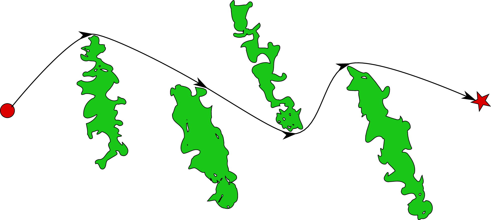
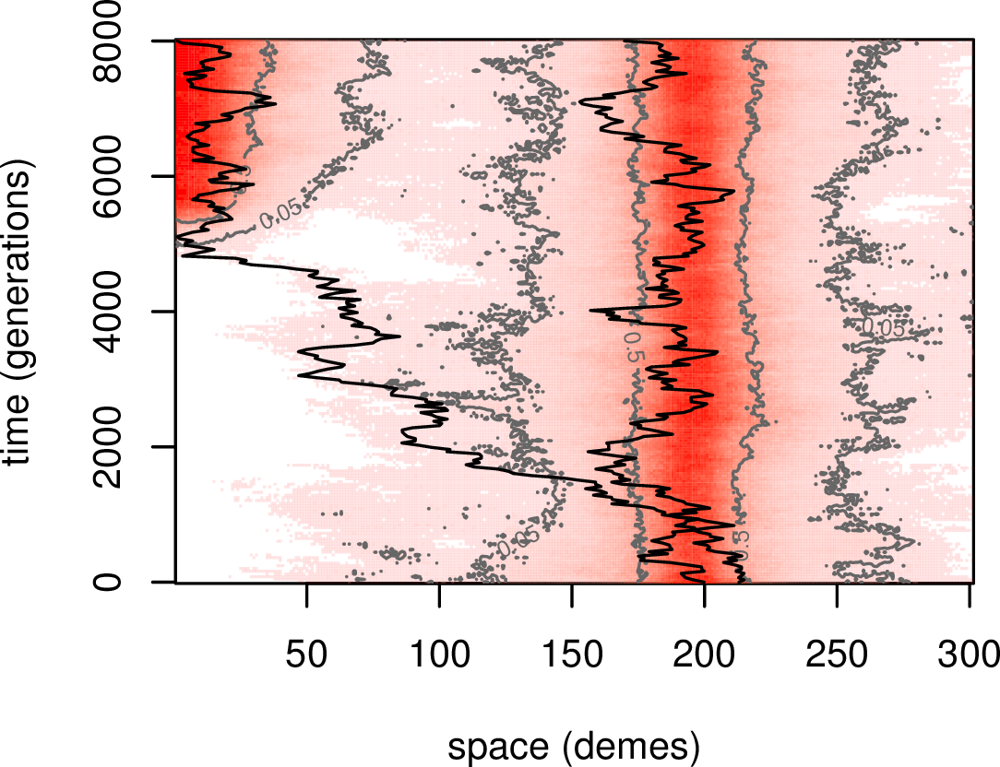

# Adaptation to climate change

--------------

*Rapid* climate change:

- occurring over tens of generations
- different environment $\Rightarrow$ strong selective pressure

*This talk:* population genetics considerations.


-----------------

**What I'm not talking about:**

- local adaptation
- plasticity
- genetic architecture
- population size dynamics
- interspecific interactions

**What I am talking about:**

- most organisms don't live on billiard tables


Questions
---------

How does geography affect how adaptive variants

1. arise and

2. spread,

3. and how much variation is left afterwards?


--------------

**Can adaptations spread?**

- with moving environmental gradients
- or from locations of existing variants

Also relevant for:

- Do adaptive variants spread along wildlife corridors?
- What is the spatial resolution of adaptation?


------------------------------

{ height=6in }

------------------------------

**Population genetics wants to know:**

1.  population size

    - availability of standing deleterious variation
    - influx of new mutations

2.  strength of selection

    - probability of establishment of rare variants
    - rate of spread of adaptive variants

3.  rate of genetic drift

    - rate of local loss of variation
    - probability of establishment of rare variants


-----------------

these are affected by

**geography ${}+{}$ dispersal ${}+{}$ temporal dynamics**


# Mojave Desert habitats

------------


{ height=6in }

Cal DFG; Todd Keeler-Wolf, CNPS (http://vegetation.cnps.org/)[http://vegetation.cnps.org/]

---------------

Zoomed-in (NVCS macrogroup):


---------------

**Environmental niche models:** (Biogeography Lab, UCSB)


Demographic model
-----------------

- 200m grid
- equilibrium density: 0.4 (low) or 16 (high) / ha 
- R package: [github.com/petrelharp/landsim](github.com/petrelharp/landsim)

```
demography(
    prob.seed = 0.2, fecundity = 100,
    pollen.migration = migration(
        kern = function (x) { exp(-sqrt(x)) },
        sigma = 300, radius = 1200, normalize = NULL ),
    seed.migration = migration(
        kern = "gaussian", sigma = 100,
        radius = 1200, normalize = 1 ),
    prob.germination = vital(
        function (N, ...) {
            out <- r0 / ( 1 + rowSums(N)/carrying.capacity )
            return( cbind( aa=out, aA=(1+s)*out, AA=(1+s)^2*out ) )
        },
        r0 = 0.01,  s = 0.05 ),
    prob.survival = 0.9,
    genotypes = c("aa","aA","AA")
 )
```


# Rate of genetic drift

-------------

**Wright's neighborhood size:**

$$ N_\text{loc} \propto \#\{ \text{ individuals within 1$\sigma$ } \}, $$

where 

-  $\sigma$ is the **dispersal distance**
-  *individuals* are haploid.

Local heterozygosity is
$$ H_0 \propto \frac{N_\text{loc}}{C + N_\text{loc}}, $$
where $C$ depends on mutation rate and geometry.

(Barton, Depaulis, & Etheridge)

<!--
in 1D prob of IBD is
$$ \phi(x) = \exp(-|x| \sqrt{2 \mu}/\sigma) / ( 1 + 2 N_{loc} \sigma \sqrt{2\mu} ) $$
and in 2D
$$ 1-\phi(0) = N_{\loc}/(N_{\loc} + \log(\sigma/(K\sqrt{2\mu}))) $$
For large $x$, we know $K_0(x) \sim \exp(-x)/\sqrt{x}$.
-->


-----------------

$N_\text{loc}$ at different scales depends on population density
and *amount of nearby habitat:*


-----------------

NVCS Macrogroup, central Mojave:


----------

Creosote:

{ height=6in }

----------

Blackbrush:

{ height=6in }

----------

Wash:

{ height=6in }


-----------------

**Genetic drift:** 

$$\var[p_{t+1}|p_t]/p_t(1-p_t) \text{  against  } N_\text{loc}$$

{ height=4.5in }


# Probability of establishment

-------------------

The *probability of establishment* 
of a single allele
in a large population is
$$ p_\text{estab} \approx 2 s / \nu , $$

-  where $\nu$ is the strength of drift
- $s$ is growth rate when rare.

If $s < 1/N_\text{loc}$, *local inbreeding* 
may reduce $p_\text{estab}$.


----------------------------


# Speed of spread

---------------

Alleles that are advantageous when rare
spread, like *wildfire*. 
(a "pulled" wave)

**Continuous habitats**

- speed: $\sigma \sqrt{2s}$ (Fisher/KPP)
    * $s$ is *growth rate when rare*
    * takes 1-10 generations to move a dispersal distance

- leptokurtic dispersal: patchy, accelerating (Mollison 1972)

- slowed by drift

---------

**Huygens principle:** the wave has to go around barriers (Möbius, Murray, & Nelson 2015)

- *tortuosity*: ratio of length of curve to distance between its ends




------------------

{ width=10in height=3.33333in }

------------------

{ width=10in height=3.33333in }


------------------


---------------

Speeds in different habitats:


<!-- Naive prediction has $\sigma=250$. -->


-------------------

**Spread in patchy habitats**

- spread governed by arrival of migrants
    ${} \times p_\text{estab}$

- if gaps are totally uninhabitable (sparks carried by wind),
    depends on *long distance dispersal*

-------------------


- if growth rate in gaps is $1-m$ (flammable but fire dies out)
    rate of migrant families is 

    $$\propto e^{-x \sqrt{2m}/\sigma}$$

{ width=6in }

Both depend critically on *dispersal* mechanism.


# Conclusions


-----------

- Adaptation in connected habitats depends on habitat shape, but only weakly.

- Adaptation is strongly affected by

    * connectivity
    * long-distance dispersal
    * population size
    * ecological interactions

Notes:

- Allee affects?
- Ubiquitous, polygenic variation?
- Many habitats are patchy: are they still connected?
- Shape of isolation by distance?


Thanks!
-------

- Erik Lundgren (USC)
- Julie Evens (CNPS)
- Greg Suba (CNPS)
- R's GIS tools: `sp`, `raster`, `rgeos`, ...

* NSF: ABI
* Sloan Foundation

The R package: github.com/petrelharp/landsim

